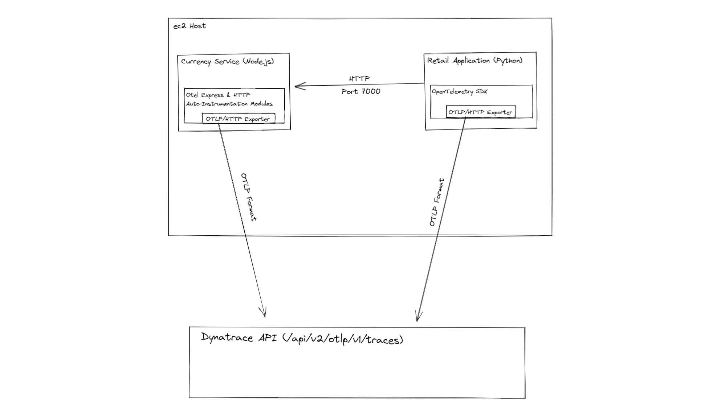

# Distributed Traces with OpenTelemetry - Standalone

## Session Objectives

This is the first lab of the OpenTelemetry Enablement Series. It focuses on utilizing OpenTelemetry with Dynatrace to gain observability into your applications and services. We will only focus on ingesting traces for this lab, as metrics and logs will be covered in a separate series. We will cover the following:

1. Understanding Open-Telemetry and its use cases.
2. Open-Telemetry instrumentation types and Dynatrace support.
3. Setting up the sample Retail Application and Currency Service to generate traces.
4. Configuring Dynatrace to receive traces.
5. Open-Telemetry configurations in Dynatrace.

<!-- ------------------------ -->

## OpenTelemetry - Introduction

> OpenTelemetry is a collection of tools, APIs, and SDKs that allow users to instrument their applications to collect various sources of telemetry data (metrics, logs, traces). OpenTelemetry is a great alternative if trying to monitor a technology or framework the Dynatrace OneAgent doesn't support for automatic instrumentation and deep monitoring. With OpenTelemetry, you can manually instrument your applications and send the telemetry data to Dynatrace for aggregation and analysis.

## OpenTelemetry - Basic Terminology

- Trace -> Equivalent to a PurePath
- Span
- Context Propagation
- W3C Trace Context
  - Span id
  - Parent id
- Collector
  - Receiver
  - Processor
  - Exporter
- Automatic instrumentation
- Manual instrumentation

<!-- ------------------------ -->

## OpenTelemetry - Instrumentation Types and Dynatrace Support

There are three high-level steps involved in sending traces to Dynatrace.

- Instrumenting the application with OpenTelemetry.
- Preparing Dynatrace to receive the traces.
- Sending the traces to Dynatrace.

### 1.) Instrumenting the application with OpenTelemetry

The first step in getting traces to Dynatrace is instrumenting your code with OpenTelemetry to capture the telemetry data. There are two different approaches you can take: manual or automatic instrumentation. Manual instrumentation provides developers with a set of core tools (OpenTelemetry API & SDK) to manually configure the areas of their application they want monitored. If manual instrumentation isn't preferred, auto-instrumentation can be used. For every language/technology that OpenTelemetry supports, there are generally auto-instrumentation libraries provided for common frameworks used in the language. It is recommended to utilize auto-instrumentation libraries when possible as it reduces the chance of errors being introduced into your application and also reduces the amount of future maintenance required as the library author is responsible for maintaining the instrumentation instead of application developers.

For auto-instrumentation setups, generally all that's required is the library be imported into the application along with a setup call that provides some additonal context (Data source specific configuration, Exporter configuration, Propagator configuration, Resource configuration). (REWORD)

This lab will combine both forms of instrumentation. Our Retail Application uses manual instrumentation to capture some requests related to the cart functionality, while our Currency Service utilizes auto-instrumentation for telemetry. Please refer to the code for additional details on how it is done.

### 2.) Preparing Dynatrace to receive our traces

There are two different options when it comes to sending OpenTelemetry traces to Dynatrace: The Dynatrace API or the OneAgent OpenTelemetry Sensors.


The Dynatrace OneAgent can tap-into OpenTelemetry running in your applications and send the data to Dynatrace. This can be accomplished by having a OneAgent running on the host along with the OpenTelemetry configuration pointing to a local endpoint. When using the OneAgent to ingest OpenTelemetry traces, there is no licensing cost incurred for the ingested traces.


If you decide to use OpenTelemetry without a OneAgent, you will need to configure some form of exporter to send the traces to the Dynatrace API. Generally, an OpenTelemetry Collector is used to receive, process, and export telemetry data to an observability backend. It offers a vendor-agnostic implementation and removes the need to run, operate, and maintain multiple agents/collectors. However, an OpenTelemetry Collector is not explicitly required. You can simply use an OTLP/HTTP exporter that's provided with the Core SDK. At the moment, the Dynatrace API only supports the OTLP format. Ingesting traces through the API incurs a licensing cost for every span imported.

### 3.) Sending the traces to Dynatrace

Once you have completed the first two steps, the last step is to generate traces by interacting with your application. The OneAgent or configured exporter will automatically send the traces back to Dynatrace for aggregation and analysis. There are some additional configurations you can set in the Dynatrace UI, which will be covered later in this lab.

<!-- ------------------------ -->

## Retail Application Architecture

Before we begin, let's review the architecture of the Retail Application. There are two main components we need to be familiar with: the Retail Application and the Currency Service.



The Retail application is a simple Django app written in Python. It simulates a basic ecommerce website with various products that can be added to a cart and purchased. Our cart UI has a button labeled "Convert Currency" that can be used to convert the cart total from USD to EUR. Everytime the cart page is accessed, the Retail application makes an HTTP request to the Currency Service to convert the cart total from USD to EUR. When the button in the UI is clicked, a browser popup with the conversion total appears. The popup will display "-1" if an error has occurred.

The Currency service is a Node.js application written using the Express framework. It takes requests with a USD currency total and returns the appropriate EUR conversion.

<!-- ------------------------ -->

## Start the Currency Service

Traverse to the Currency Service directory:

```bash
cd currencyservice
```

We need to install the node dependencies:

```bash
npm install
```

Set the PORT environment variable to 7000:

```bash
export PORT=7000
```

Start the Currency Service:

```bash
node server-http.js &
```

<!-- ------------------------ -->

## Start the Retail Application

Navigate to the `/home/otelworkshop/retailapp` folder by using the following command:

```bash
cd ~/retailapp
```

Before we continue, we need to install the dependencies for the retail application. If prompted for a password, use the same one that was used to login.

```bash
./bin/devinstall
```

Copy the Nginx configuration file to the Host's Nginx configuration

```bash
sudo cp nginx.conf /etc/nginx/
```

Restart the Nginx Service

```bash
sudo service nginx restart
```

To properly run our Retail application, we need to gather the following information:

- API Token
- Dynatrace Tenant URL

### Generate API Token

1. Open your browser and access the Dynatrace URL.
2. Select **Access Tokens** from the Manage section of the Dynatrace navigation menu.
3. Click **Generate New Token** on the Access Tokens page.
4. Give your token a name, then add the `openTelemetryTrace.ingest` permission within the token scope.
5. Click **Generate Token** at the bottom of the page to create the API Token, make sure to copy the token value and save it somewhere you'll remember, as we won't be able to retreive this value again.


### Generate Dynatrace Trace Ingest Enpoint

Take your Tenant URL and append the value `/api/v2/otlp/v1/traces`. This will be your `DT_TENANT_URL`.

### Activate Virtual Environment & Configure Environment Variables

Now, we can activate the Retailapp virtual environment that our install script has setup for us:

```bash
source env/bin/activate
```

The values that were just noted need to be set as environment variables for the Retail Application. Open the setenv script and paste in the values for `DT_TENANT_URL` and `DT_API_TOKEN`:

```bash
nano bin/setenv
```

After pasting in the values, run the script to populate the current shell:

```bash
source bin/setenv
```

We can now start our application with Gunicorn. Navigate to the src directory and run the application:

```bash
cd src
gunicorn --bind 0.0.0.0:3005 ecommerce.wsgi:application -c gunicorn.config.py &
```

Verify the application started successfully by accessing `AWS-IP:80` in your browser.

<!-- ------------------------ -->

## Load Retailapp in Browser

Since the Retail Application is utilizing manual instrumentation, only the parts of the application we instrumented will generate traces. For this lab, most of the functionality surrounding the cart is instrumented. Create an account on the Retail Application to begin adding items to it. Once logged in, add items to your cart and navigate to the cart page to view your total. If the steps were followed correctly, clicking on the convert button should generate a browser pop-up that will display our total in Euro's.

<!-- ------------------------ -->

## View Traces in Dynatrace and Whitelist Attributes

At this point, we should have some traces to view in our Dynatrace tenant from the Retail application. Our Currency Service won't have any yet, as we did not enable auto-instrumentation. Navigate to the Distributed Traces page within the Applications & Microservices menu section and click into the `Request to Currency Service` PurePath. Within our trace summary, notice the two sections 'Attributes' and 'Resource Attributes'.


OpenTelemetry allows you to provide metadata about your Resources and the Spans they emit via key-value pairs called attributes. We have created a span attribute called `conversion_total` to track the conversion amount returned by the Currency Service. It can be seen that Dynatrace is detecting it within the span attribute section. Attributes need to be whitelisted in Dynatrace in order to show up within PurePaths. To whitelist the span attribute, you can either do it directly from the indicators in the trace summary or from the Server-side service monitoring section of the Settings menu. Note that we won't see the attribute values in Dynatrace until we generate more traces.

<!-- ------------------------ -->

## Enable Auto-Instrumentation on Currency Service

In this step, you will be stopping the running instance of our Currency Service and starting another with auto-instrumentation enabled for additional visibility in Dynatrace.

Navigate back to the Currency Service directory:

```bash
cd ~/currencyservice
```

Get the Process Id of the Currency Service:

```bash
ps
```

Look for the node process under the CMD column and note the PID. We will use it in our next command to kill the process:

```bash
kill -9 <PID>
```


We need to set some additional environment variables so OpenTelemetry knows where to send the telemetry data. Open the setenv script and paste in your API token and Tenant URL to the `DT_TENANT_URL_CS` and `DT_API_TOKEN_CS` lines:

```bash
nano bin/setenv
```

Next, run the script:

```bash
source bin/setenv
```

Now, we'll run the Currency Service with OpenTelemetry instrumentation:

```bash
node --require ./tracing.js server-http.js &
```

After going back to `AWS-IP:80` and generating traffic, we should see both Retail App and Currency Service spans showing up on the Distributed Traces page. If you click back into the `Request to Currency Service` trace, we should also see the `conversion_total` attribute now displaying properly.

<!-- ------------------------ -->

## Enable Context Propagation

Since they were part of the same transaction, wouldn't it be nice if our Currency Service's spans were nested within the Retail Application's HTTP request spans? We can do this with Context propagation. Context propagation allows us to connect spans from different processes all within the same trace. Our Retail application will use the `traceparent` HTTP header described in the W3C TraceContext standard to propagate the span information over to the Currency Service. Since the Currency Service uses an auto-instrumentation library for the HTTP & Express frameworks in Node.js, it will automatically create a child span based on the context from the `traceparent` header and Dynatrace will be able to link the two together. Note that if the Currency Service was manually instrumented like the Retail Application, we would have to manually extract the `traceparent` data and apply them to the new spans that are about to be created.

For this lab, all we need to do to enable context propagation is set the `CONTEXT_PROPAGATION` environment variable to true prior to starting the retail application. Set the value to TRUE, then restart the retail application.

Navigate back to the Retail Application directory and stop the currently running instance:

```bash
cd ~/retailapp
ps
kill -9 <PID>
```

Set the `CONTEXT_PROPAGATION` environment variable

```bash
export CONTEXT_PROPAGATION="TRUE"
```

Start the retail app

```bash
cd src
gunicorn --bind 0.0.0.0:3005 ecommerce.wsgi:application -c gunicorn.config.py &
```

<!-- ------------------------ -->

## Load Retailapp again

Re-visit the retail application in your browser and add a few more items to your cart. After visiting your cart, you should notice nested traces beginning to appear in your Dynatrace tenant.
